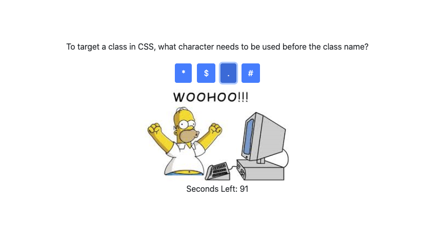

I created this Ultimate Coding Quiz during my time at Northwestern Full Stack Coding Bootcamp. The assignment was as follows:

Build a timed code quiz with multiple-choice questions. This app will run in the browser and feature dynamically updated HTML and CSS powered by your JavaScript code. It will also feature a clean and polished user interface and be responsive, ensuring that it adapts to multiple screen sizes.

There was specific criteria that we had to meet, which is listed below:

GIVEN I am taking a code quiz
WHEN I click the start button
THEN a timer starts and I am presented with a question
WHEN I answer a question
THEN I am presented with another question
WHEN I answer a question incorrectly
THEN time is subtracted from the clock
WHEN all questions are answered or the timer reaches 0
THEN the game is over
WHEN the game is over
THEN I can save my initials and score

Below are some screenshots of the quiz:

When the user guesses the correct answer:

When the user guesses the wrong answer:

At the end of the quiz, users can submit their score:

I also created a dynamically updated leaderboard that is stored in Local Storage. Users can clear the leaderboard or play again for a better score: 

Here is a link to the deployed application: https://klynch94.github.io/Code-Quiz/
